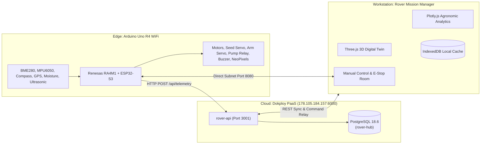

# Autonomous Maize Rover: Mission Manager & Cloud IoT Ecosystem

[](https://github.com/Elikplim-N/rover-mission-manager)
[](https://www.postgresql.org/)
[](https://store.arduino.cc/products/uno-r4-wifi)
[](https://react.dev/)
[](https://threejs.org/)

An integrated precision agriculture cyber-physical system for autonomous maize planting, micro-irrigation, multi-sensor terrain telemetry, real-time cloud ingestion, remote E-Stop safety, and 3D digital-twin visualization.

---

## Architecture Topology

```
Sensors → Arduino Uno R4 WiFi → Wi-Fi HTTP POST → Dokploy (Node/Express + PostgreSQL 18.6) → Web Workstation
```



---

## Key Features

1. **Pure Cloud-First IoT Pipeline (No SD Card)**:
   - Physical SD card breakouts are eliminated by design, avoiding SPI pin collisions with seed servos, buzzers, arm servos, and NeoPixel status lights.
   - Dedicates Pin `D4` strictly to **Left Motor Enable (`MOTOR_LEFT_EN`)**.
   - Completely removes mechanical socket vibration failures over furrow soil.
2. **Preemptive 3-State Machine & Remote E-Stop**:
   - `AUTO_MISSION`: Autonomous boustrophedon furrow traversal and periodic planting cycle.
   - `MANUAL_OVERRIDE`: Allows operator to drive the rover (WASD / arrow keys) and test individual actuators for defense demo.
   - `EMERGENCY_STOP`: Immediate remote safety kill (0% PWM, forced pump cut, warning buzzer horn, flashing red LEDs).
   - Embedded `WiFiServer` on **Port 8080** for direct `<20ms` latency control on the field Wi-Fi / mobile hotspot.
3. **Relative Micro-Topography Tare Engine**:
   - Automatically averages 12 barometric altitude samples during boot with the Bosch BME280.
   - Computes relative elevation $\Delta \text{Elev} = \text{Alt}_{\text{current}} - \text{Alt}_{\text{baseline}}$ for real-time 3D terrain reconstruction.
4. **Production Dokploy Ingestion Stack**:
   - Containerized Express REST service on port `3001`.
   - Connected live to **PostgreSQL 18.6** (`rover-hub` on `178.105.184.157:6000`).
5. **Interactive 3D Digital Twin**:
   - Three.js WebGL surface reconstruction with dynamic elevation heatmaps and boustrophedon furrow playback.
   - Smooth spherical linear interpolation (`slerp`) matching MPU-6050 pitch and roll.

---

## Repository Structure

```
├── docs/
│   └── ARCHITECTURE_KNOWLEDGE_BASE.md   # Complete system architecture specification
├── firmware/
│   ├── MaizeRover_Phase2_Master/        # Arduino Uno R4 WiFi firmware (.ino)
│   │   └── MaizeRover_Phase2_Master.ino
│   └── README.md                        # Pinout manual & hardware guide
├── server/                              # Dokploy Cloud Ingestion API
│   ├── Dockerfile                       # Production Node 20 container
│   ├── docker-compose.yml               # 1-click Dokploy stack definition
│   ├── db.js                            # PostgreSQL auto-migration & client
│   ├── index.js                         # REST endpoints (/api/telemetry, /api/command, /api/missions)
│   └── package.json
└── src/                                 # Web Application Workstation
    ├── components/
    │   ├── Layout.tsx                   # Navbar with global quick E-Stop trigger
    │   └── Terrain3D.tsx                # Three.js 3D terrain & rover kinematic visualizer
    ├── pages/
    │   ├── Dashboard.tsx                # Fleet operations & quick cloud sync
    │   ├── Teleop.tsx                   # Manual control pad, E-Stop, and actuator test bench
    │   ├── Library.tsx                  # Mission Hub & Dokploy synchronization
    │   ├── MissionView.tsx              # Detailed 3D playback & telemetry inspector
    │   ├── Analytics.tsx                # Multi-series Plotly agronomic charts
    │   ├── Fields.tsx                   # Agricultural plot boundary manager
    │   └── Planner.tsx                  # Furrow path planning & simulation
    └── lib/
        ├── api.ts                       # Dokploy REST client & direct LAN teleop driver
        ├── db.ts                        # Dexie.js IndexedDB schema
        └── utils.ts                     # Telemetry parsers & mathematical models
```

---

## 19-Channel Telemetry Schema

```csv
Row,Drop,SynX,SynY,Volt,TempC,Hum,Press,Elev,Moist,Watered,AbsHead,Err,Pitch,Roll,Lat,Lng,Sats,ObsDist
```

| Field | Type | Description |
| :--- | :--- | :--- |
| `Row`, `Drop` | Int | Furrow row index and planted drop index |
| `SynX`, `SynY`| Float (m) | Local orthogonal Cartesian grid coordinates |
| `Volt` | Float (V) | Rover battery voltage bus |
| `TempC`, `Hum`, `Press` | Float | Ambient canopy temperature (°C), humidity (%), and pressure (hPa) |
| `Elev` | Float (m) | Relative terrain micro-elevation above baseline |
| `Moist`, `Watered` | Int / Bool | Soil moisture reading (0–1023) and irrigation dose flag |
| `AbsHead`, `Err` | Float (deg) | Compass azimuth and furrow course tracking error |
| `Pitch`, `Roll` | Float (deg) | Fore-aft and transverse rover inclination angles |
| `Lat`, `Lng`, `Sats` | Float / Int | GNSS coordinates and satellite count |
| `ObsDist` | Float (cm) | Distance to nearest forward obstacle |

---

## Getting Started

### 1. Web Workstation (Frontend)
```bash
# Install dependencies
npm install

# Run locally in development mode
npm run dev
# Accessible at http://localhost:5173

# Build production bundle
npm run build
```

### 2. Dokploy Backend Deployment
```bash
cd server
npm install
npm start
# Runs on http://localhost:3001
```
Or deploy [`server/docker-compose.yml`](server/docker-compose.yml) directly in Dokploy.

### 3. Flashing the Rover
1. Open [`firmware/MaizeRover_Phase2_Master/MaizeRover_Phase2_Master.ino`](firmware/MaizeRover_Phase2_Master/MaizeRover_Phase2_Master.ino) in the Arduino IDE.
2. Select **Board: Arduino Uno R4 WiFi**.
3. Update `WIFI_SSID` and `WIFI_PASS` with your farm Wi-Fi or mobile hotspot credentials.
4. Upload to the rover.
