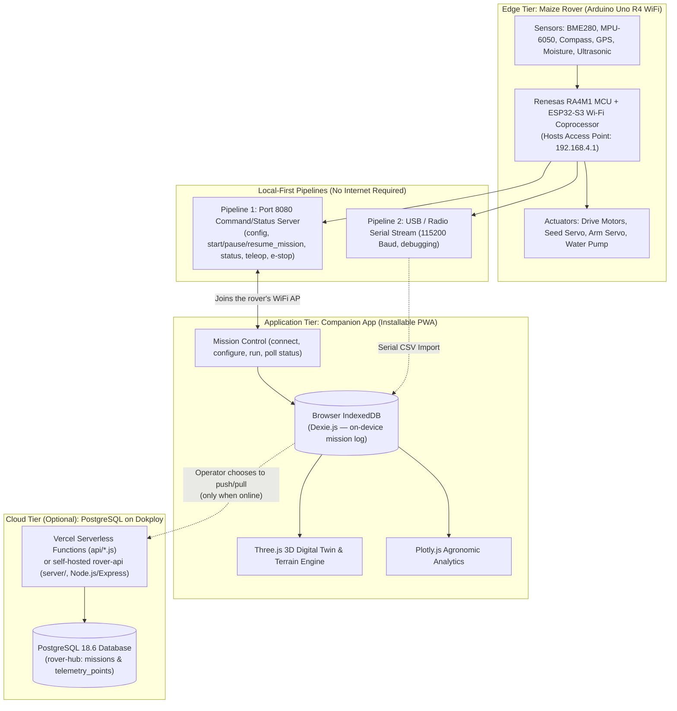
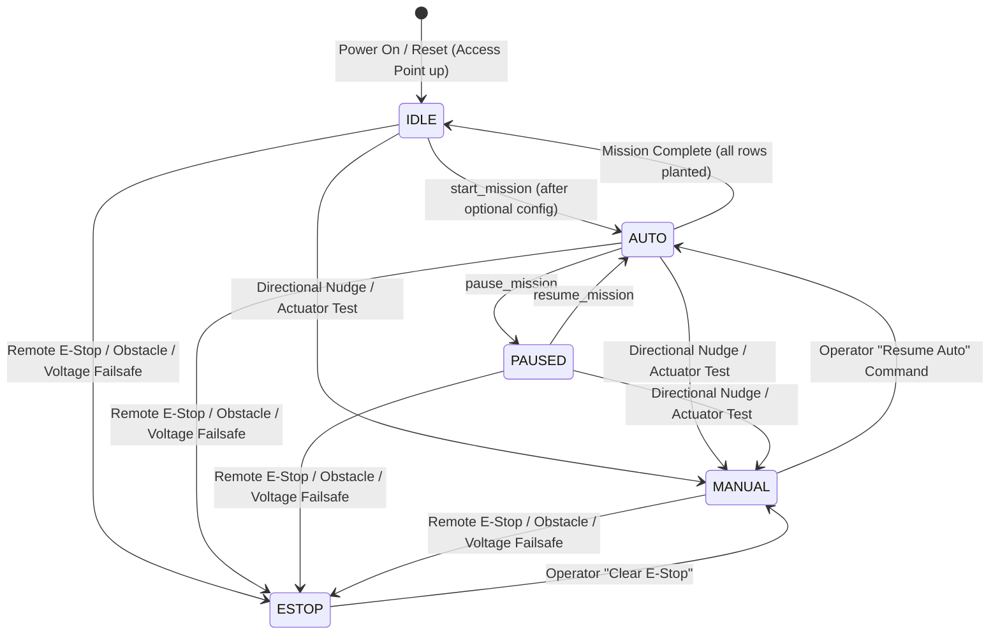
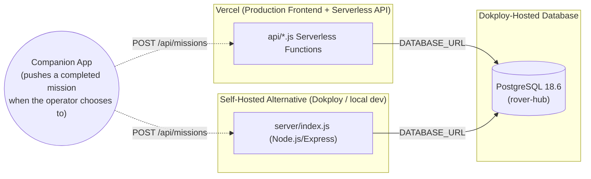
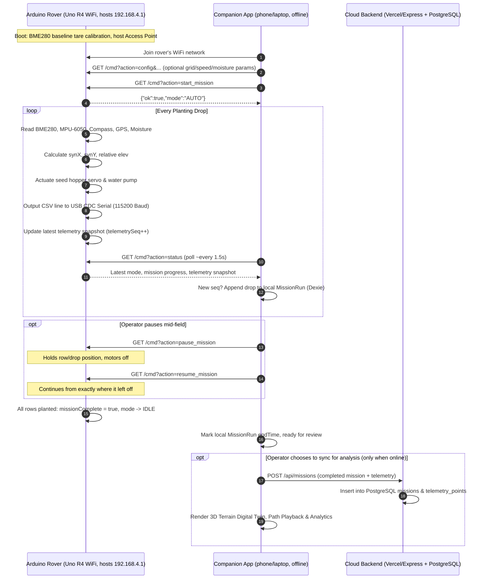

# Autonomous Maize Rover System: Architecture Knowledge Base

**System Name**: Autonomous Precision Agriculture Maize Rover Ecosystem  
**Target Platform**: Arduino Uno R4 WiFi (MCU, hosting its own local Access Point), Companion Mobile/Web App (Local-First Mission Control, Offline Storage, 3D Digital Twin), Optional Cloud Backend (Vercel Serverless + Dokploy-hosted PostgreSQL, for post-mission analysis only)  
**Document Classification**: Architectural Reference & Technical Knowledge Base

---

## 1. Executive System Overview & Core Architecture Axiom

> **Core Architectural Pipeline**:  
> **`Sensors → Arduino Uno R4 WiFi (hosts its own Access Point) → Local HTTP (Port 8080) → Companion App (Dexie/IndexedDB, on-device log) → [optional, when a connection exists] Cloud Push → PostgreSQL → Web Workstation (Analytics/3D Digital Twin)`**
>
> **Architectural Simplification**: Physical MicroSD card breakouts and manual CSV sneakernet file transfers are **eliminated**, and so is any dependency on field internet access. The rover hosts its own WiFi network at a fixed address; a phone or laptop joins it, configures and runs the mission, and logs every drop straight to that device's own storage. Nothing about running or recording a mission requires a server, a router, or a mobile data connection. Pushing a completed mission to the cloud is a separate, optional step the operator takes afterward, purely so the web workstation can render 3D terrain and analytics for missions they choose to share.

The system consists of three primary architectural tiers:
1. **Edge Tier (Rover Cyber-Physical Unit)**: Renesas RA4M1 32-bit MCU + ESP32-S3 Wi-Fi (Arduino Uno R4 WiFi) capturing multi-spectral environmental, inertial, and geospatial telemetry, triggering PWM/relay actuators, and hosting the local Access Point (`192.168.4.1`) that the rest of the system talks to.
2. **Application Tier (Companion App, Local-First)**: An installable Progressive Web App built with React 19, TypeScript, Three.js, and Plotly. It connects to the rover over its Access Point, drives the mission configuration/start/pause/resume lifecycle, and is the sole place a mission's telemetry is logged in the field, via Dexie.js (IndexedDB). It works fully offline and is the same application used later for analysis.
3. **Cloud Tier (Optional, Post-Mission Analysis Only)**: A PostgreSQL 18.6 database hosted on Dokploy, reached either through Vercel serverless functions (the deployed production frontend) or a standalone Node.js/Express service (for local/self-hosted use). The rover itself never talks to this tier; the app pushes a completed mission to it only when the operator chooses to and a connection happens to be available.



---

## 2. Edge Tier Architecture (Firmware & Embedded Hardware)

### 2.1 Microcontroller Constraints & Local-First Architecture

| Hardware Parameter | Specification | Architectural Consequence | Architectural Decision (Local-First) |
| :--- | :--- | :--- | :--- |
| **Microcontroller** | Renesas RA4M1 (Arm Cortex-M4 @ 48 MHz) | 32-bit execution, native USB, FPU | Real-time trigonometric coordinate dead-reckoning and orientation filters. |
| **SRAM** | 32 KB | Volatile; erased upon battery disconnect | SRAM holds active loop state, mission parameters, and the latest telemetry snapshot only. |
| **Data Flash (EEPROM)** | 8 KB | Limited to ~75 telemetry lines | Bypassed. The rover never accumulates a mission log itself; the companion app logs each drop as it happens. |
| **Physical SD Card** | *Omitted by Design* | Pins D10–D13 conflict with servos/buzzer/LEDs; pin D4 needed for motor enable | **Eliminated**. Avoids SPI bus pin contention, eliminates mechanical vibration failure on rough soil, and saves ~80mA current spikes. |
| **Primary Telemetry** | ESP32-S3 Coprocessor (Uno R4 WiFi) | 2.4 GHz 802.11 b/g/n Wi-Fi, in Access Point mode | **Local Status Snapshot**: the rover hosts its own network at `192.168.4.1` and exposes the latest drop's telemetry via `GET /cmd?action=status`; the connecting app polls this and logs it on-device. The rover has no path to the internet by design and never pushes telemetry itself. |
| **Secondary Telemetry** | USB CDC Serial (115200 Baud) | Real-time CSV line printing | Live local workstation/field laptop telemetry mirror for bench debugging. |

### 2.2 Pinout & Peripheral Assignment

```
Arduino Uno R4 Pinout
├── I2C Bus (Pins A4/SDA, A5/SCL)
│   ├── Bosch BME280 (0x76/0x77): Ambient Temp, Humidity, Pressure, Barometric Altitude
│   ├── MPU-6050 6-DoF IMU (0x68): Pitch & Roll inclination angles
│   └── HMC5883L / QMC5883L (0x1E / 0x0D): Absolute compass heading
├── Analog Inputs
│   ├── A0: Soil Moisture Probe (0 - 1023 ADC raw resistance/capacitance)
│   ├── A1: Battery Voltage Divider (B25 module, 5:1 divider, 0-25V range)
│   ├── A2: Ultrasonic Trigger (HC-SR04 pulse initiation)
│   └── A3: Ultrasonic Echo (HC-SR04 return pulse duration)
├── Actuators & Motor Control
│   ├── D3 (PWM): Left Motor Forward (RPWM)
│   ├── D4 (GPIO): Left Motor Enable / Remappable SPI CS
│   ├── D5 (PWM): Left Motor Reverse (LPWM)
│   ├── D6 (PWM): Right Motor Forward (RPWM)
│   ├── D7 (GPIO): Water Pump Relay (Active LOW actuation)
│   ├── D8 (GPIO): Right Motor Enable
│   ├── D9 (PWM): Right Motor Reverse (LPWM)
│   ├── D10 (PWM): Seed Dispenser Hopper Servo (0° closed, 60° open gate)
│   ├── D11 (PWM): Piezo Buzzer (acoustic system alert & obstacle warning)
│   ├── D12 (PWM): Articulated Tool Arm Servo (90° transit position)
│   └── D13 (GPIO): WS2812B NeoPixel RGB Status Array (Green = Run, Red = Obstacle, Amber = Init)
└── Serial Interfaces
    ├── Serial (USB CDC): Primary telemetry output stream @ 115200 Baud
    └── Serial1 (D0 RX, D1 TX): GNSS / GPS Receiver @ 9600 Baud (TinyGPS++)
```

### 2.3 Sensor Processing & Mathematical Transformations

1. **Relative Terrain Elevation (`Elev`)**:
   - Barometric pressure fluctuates by weather. An absolute altitude calculation shifts across hours.
   - **Solution**: The firmware executes a **tare calibration** during `setup()` by averaging 10 readings of `bme.readAltitude(1013.25)`.
   - Telemetry computes relative elevation as:
     $$\Delta \text{Elev} = \text{Altitude}_{\text{current}} - \text{Altitude}_{\text{baseline}}$$
2. **Synthetic Dead-Reckoning Grid (`SynX`, `SynY`)**:
   - In field environments where GNSS precision suffers from multipath error or tree canopy cover, the rover tracks row and drop indices using boustrophedon (serpentine) navigation:
     - For odd rows ($Row \pmod 2 \neq 0$): $\text{SynX} = (Drop - 1) \times S_{\text{drop}}$
     - For even rows ($Row \pmod 2 = 0$): $\text{SynX} = (N_{\text{drops}} - Drop) \times S_{\text{drop}}$
     - In both rows: $\text{SynY} = (Row - 1) \times S_{\text{row}}$
3. **Course Error (`Err`)**:
   - Deviation between target furrow heading ($\theta_{\text{target}} \in \{90^\circ, 270^\circ\}$) and absolute magnetometer heading ($\theta_{\text{abs}}$), normalized to $[-180^\circ, +180^\circ]$.

### 2.4 Operational State Machine & Teleoperation Architecture

To support a simple mission lifecycle (configure, start, pause mid-field, resume, complete) alongside testing and field safety, the rover firmware implements a five-state machine:



#### Key Capabilities:
1. **Local Mission Lifecycle**:
   - `config`: applies grid geometry, drive speed, and moisture threshold before or between runs; all parameters optional.
   - `start_mission`: resets the row/drop counters and begins autonomous traversal from `IDLE`.
   - `pause_mission` / `resume_mission`: holds and restores the exact row/drop position, so a mission can be safely interrupted mid-field (e.g. to clear an obstacle by hand) and continued later.
   - `status`: read-only snapshot of mode, mission progress, and the latest drop's full telemetry, polled by the companion app to log each drop on-device.
2. **Testing & Defense Demo Mode**:
   - Allows operator to drive the rover to a furrow starting point without triggering an autonomous planting cycle.
   - Independent actuator test bench: single seed kernel drop (Hopper Servo D10), single water micro-dose 400ms pulse (Relay D7), articulated arm toggle (Servo D12).
3. **Safety & Remote E-Stop**:
   - Preempts all states immediately. Forces motor PWM to 0, cuts pump power, activates continuous horn tone and flashing red NeoPixels.
   - Global E-Stop trigger accessible in header navigation bar across the entire companion app.
4. **Local-First Command Channel**:
   - **Rover's own Access Point (Port 8080)**: Direct HTTP GET commands (`http://192.168.4.1:8080/cmd?action=...`) with $<20\text{ ms}$ latency once the phone/laptop has joined the rover's WiFi network. This is the only channel the rover itself understands.
   - **Cloud Relay (optional, app-side fallback)**: if the app also has a Dokploy/Vercel server URL configured and the direct link is unreachable, teleop commands fall back to `POST /api/command` on that server for convenience during bench testing off the rover's network; this has no bearing on mission operation in the field.
5. **Deadman Safety Timeout**:
   - In `MANUAL`, motors automatically stop if no directional command is received within **600ms**, preventing rover runaway on lost WiFi packets.

---

## 3. Telemetry Protocol Specification

Every drop is recorded using the same exact 19-column schema everywhere it appears: the rover's local `/cmd?action=status` snapshot, its USB CSV mirror, the companion app's on-device Dexie log, and — if a mission is later pushed to the cloud — the PostgreSQL `telemetry_points` table:

```csv
Row,Drop,SynX,SynY,Volt,TempC,Hum,Press,Elev,Moist,Watered,AbsHead,Err,Pitch,Roll,Lat,Lng,Sats,ObsDist
```

### 3.1 Field Dictionary

| Column | JSON Key | Type | Unit | Range | Description |
| :--- | :--- | :--- | :--- | :--- | :--- |
| **Row** | `row` | Integer | - | $1 \dots \infty$ | Furrow index across the agricultural plot |
| **Drop** | `drop` | Integer | - | $1 \dots N$ | Planted seed index within the active furrow |
| **SynX** | `synX` | Float | m | $0.00 \dots X_{\max}$ | Local orthogonal Cartesian X-coordinate |
| **SynY** | `synY` | Float | m | $0.00 \dots Y_{\max}$ | Local orthogonal Cartesian Y-coordinate |
| **Volt** | `volt` | Float | V | $0.00 \dots 14.80$ | Rover power bus battery voltage |
| **TempC** | `tempC` | Float | °C | $-10.0 \dots 65.0$ | Ambient canopy temperature |
| **Hum** | `hum` | Float | % | $0.0 \dots 100.0$ | Ambient relative humidity |
| **Press** | `press` | Float | hPa | $800.0 \dots 1100.0$| Barometric atmospheric pressure |
| **Elev** | `elev` | Float | m | $-50.0 \dots 50.0$ | Relative micro-topography ground elevation |
| **Moist** | `moist` | Integer | raw | $0 \dots 1023$ | Volumetric soil moisture sensor reading |
| **Watered**| `watered`| Boolean| flag | $0 \text{ or } 1$ | Whether localized irrigation dose was dispensed |
| **AbsHead**| `absHead`| Float | deg | $0.0 \dots 359.9$ | True magnetic compass azimuth |
| **Err** | `err` | Float | deg | $-180.0 \dots 180.0$| Heading error offset relative to furrow track |
| **Pitch** | `pitch` | Float | deg | $-90.0 \dots 90.0$ | Longitudinal rover inclination (fore/aft slope) |
| **Roll** | `roll` | Float | deg | $-90.0 \dots 90.0$ | Transverse rover inclination (port/starboard slope) |
| **Lat** | `lat` | Float | deg | $-90.0 \dots 90.0$ | WGS84 GPS Latitude |
| **Lng** | `lng` | Float | deg | $-180.0 \dots 180.0$| WGS84 GPS Longitude |
| **Sats** | `sats` | Integer | count| $0 \dots 32$ | Visible and locked GNSS satellite count |
| **ObsDist**| `obsDist`| Float | cm | $0.0 \dots 999.0$ | Forward clearance to nearest obstacle |

---

## 4. Cloud Backend Architecture (Optional, Post-Mission Analysis Only)

This tier exists purely so a mission the operator has already logged locally can be pushed somewhere for 3D/analytics review later; nothing about running a mission depends on it, and the rover never talks to it directly. Two deployment shapes share the same PostgreSQL schema and a near-identical REST contract:

1. **Production deployment**: the companion app is hosted on **Vercel**, and `/api/*` is served by Vercel Serverless Functions (`api/health.js`, `api/missions.js`, `api/command.js`, `api/telemetry.js`) that connect straight to a PostgreSQL instance hosted on **Dokploy**.
2. **Self-hosted / local dev deployment**: a standalone Node.js/Express service (`server/index.js`) exposing the same endpoints, for running the whole stack (app + API + DB) under Dokploy or on a laptop without Vercel.

### 4.1 Production Database Infrastructure
- **DBMS**: PostgreSQL 18.6 (Debian 18.6), hosted on Dokploy
- **Database**: `rover-hub`
- **Connection**: supplied via the `DATABASE_URL` environment variable in both deployment shapes; never hardcoded in documentation. Rotate the credential in the Dokploy dashboard and both deployments' environment variables if it has ever been shared outside the team.
- **Current Status**: Live and active; schema (`missions`, `telemetry_points`) migrated. The Vercel deployment additionally uses `rover_commands` and `rover_status` tables to persist the teleop command relay across serverless invocations (the self-hosted Express service keeps that same state in memory instead, since it runs as a single long-lived process).



### 4.2 Relational Database Schema (PostgreSQL)

```sql
-- Missions Table: High-level mission run metadata
CREATE TABLE missions (
    id VARCHAR(64) PRIMARY KEY,
    name VARCHAR(255) NOT NULL,
    config_id VARCHAR(64),
    field_id VARCHAR(64),
    start_time TIMESTAMPTZ NOT NULL,
    end_time TIMESTAMPTZ,
    tags JSONB DEFAULT '[]'::jsonb,
    created_at TIMESTAMPTZ DEFAULT NOW(),
    updated_at TIMESTAMPTZ DEFAULT NOW()
);

-- Telemetry Points Table: Time-series drop observations
CREATE TABLE telemetry_points (
    id BIGSERIAL PRIMARY KEY,
    mission_id VARCHAR(64) REFERENCES missions(id) ON DELETE CASCADE,
    row_num INT NOT NULL,
    drop_num INT NOT NULL,
    syn_x FLOAT NOT NULL,
    syn_y FLOAT NOT NULL,
    volt FLOAT,
    temp_c FLOAT,
    hum FLOAT,
    press FLOAT,
    elev FLOAT,
    moist INT,
    watered BOOLEAN DEFAULT false,
    abs_head FLOAT,
    err FLOAT,
    pitch FLOAT,
    roll FLOAT,
    lat FLOAT,
    lng FLOAT,
    sats INT DEFAULT 0,
    obs_dist FLOAT,
    recorded_at TIMESTAMPTZ DEFAULT NOW()
);

CREATE INDEX idx_telemetry_mission ON telemetry_points(mission_id);
CREATE INDEX idx_telemetry_row_drop ON telemetry_points(mission_id, row_num, drop_num);

-- Additional tables used only by the Vercel serverless deployment, to persist
-- the teleop command relay state across invocations (the self-hosted Express
-- service keeps this in an in-memory variable instead, since it runs as one
-- long-lived process rather than per-request functions).
CREATE TABLE rover_commands (
    id BIGSERIAL PRIMARY KEY,
    action VARCHAR(32) NOT NULL,
    params JSONB DEFAULT '{}'::jsonb,
    created_at TIMESTAMPTZ DEFAULT NOW()
);

CREATE TABLE rover_status (
    id INT PRIMARY KEY,
    mode VARCHAR(16) DEFAULT 'AUTO',
    last_seen TIMESTAMPTZ,
    volt FLOAT,
    lat FLOAT,
    lng FLOAT,
    updated_at TIMESTAMPTZ DEFAULT NOW()
);
```

### 4.3 REST API Endpoints

All of these are optional from the rover's perspective — they exist for the companion app to sync a mission for later analysis, and for bench-testing teleop off the rover's own network. The rover itself only ever speaks to its local `/cmd` server (Section 2.4).

- `GET /api/health`: Health probe and service/database status.
- `GET /api/missions`: Returns list of all missions with their telemetry points, for the companion app's cloud sync/import.
- `GET /api/missions/:id`: Returns a single mission with all ordered telemetry points (self-hosted deployment only; the Vercel deployment returns full telemetry inline from `GET /api/missions`).
- `POST /api/missions`: Bulk ingest of a completed mission run, pushed by the app once the operator opts to sync it.
- `POST /api/command` / `GET /api/command`: Optional cloud relay for teleop commands, used only as a fallback when the app cannot reach the rover's own Access Point directly.
- `POST /api/telemetry`: Legacy per-drop streaming endpoint, retained for the self-hosted deployment's live-dashboard demo mode; not used by the rover firmware, which no longer has direct internet access.

---

## 5. Frontend Workstation Architecture (Web Application)

### 5.1 Tech Stack & Design Principles
- **Core Framework**: React 19, TypeScript, Vite, packaged as an installable Progressive Web App (manifest + precaching service worker) so it launches from a phone's home screen and its app shell loads with zero connectivity.
- **Client Storage**: Dexie.js (IndexedDB wrapper). This is not just an offline cache — it is the primary, authoritative log of every mission run in the field; cloud sync is a secondary copy made afterward, by choice.
- **Mission Control**: connects to the rover's Access Point, drives the `config`/`start_mission`/`pause_mission`/`resume_mission` lifecycle, and polls `status` to build up the local mission log drop by drop as it runs.
- **3D Visualization**: Three.js WebGL rendering with custom procedural terrain geometry, elevation heatmap vertex coloring, and animated rover mesh traversal.
- **Data Analytics**: Plotly.js for multi-series correlation (Soil Moisture vs Irrigation, Battery Voltage curves, Heading Error distributions).
- **UI Design System**: Tailwind CSS v4, Lucide SVG icons, zero-emoji professional engineering workstation standard, responsive drawer navigation.

### 5.2 3D Terrain Reconstruction Engine (`Terrain3D.tsx`)
1. **Grid Generation**: Calculates bounding box from $(\text{SynX}, \text{SynY})$ or translated GPS coordinates.
2. **Elevation Warping**: Maps barometric relative elevation (`Elev`) to surface vertex heights using inverse-distance weighting (IDW) interpolation.
3. **Agronomic Heatmap**: Vertex shader interpolates between deep green (low elevation/furrow bottoms) to sandy yellow and reddish-brown (high terrain ridges).
4. **Kinematic Playback**: Smooth spherical linear interpolation (`slerp`) of rover orientation, pitching and rolling according to real MPU-6050 telemetry data points.

---

## 6. End-to-End Sequence Diagram



---

## 7. Claude Prompting Cheat-Sheet (Architecture Documentation Generator)

To generate complete architectural documentation, specifications, or academic reports with Claude, use the following system prompt and input context:

### Prompt Template for Claude:
```text
You are an expert Autonomous Robotics & Precision Agriculture Systems Architect.
Using the provided "Autonomous Maize Rover System: Architecture Knowledge Base", complete the detailed system architecture documentation.

Follow these strict guidelines:
1. Preserve the 19-column telemetry specification without omitting any column.
2. Explain the hardware limitations of the Arduino Uno R4 (8KB Data Flash vs 32KB volatile SRAM) and justify why the rover hosts its own WiFi Access Point and logs nothing itself, leaving mission storage to the companion app.
3. Detail the BME280 tare baseline calibration formula for relative micro-elevation.
4. Provide the exact PostgreSQL relational schema for the optional cloud analysis backend, and be explicit that it is not on the rover's critical path.
5. Emphasize the local-first IndexedDB (Dexie) design pattern: it is the authoritative mission log, not a cache, and the same app is used for logging in the field and analysis afterward.
6. Maintain an academic, professional engineering tone with clean ASCII or Mermaid diagrams and no emojis.
```
