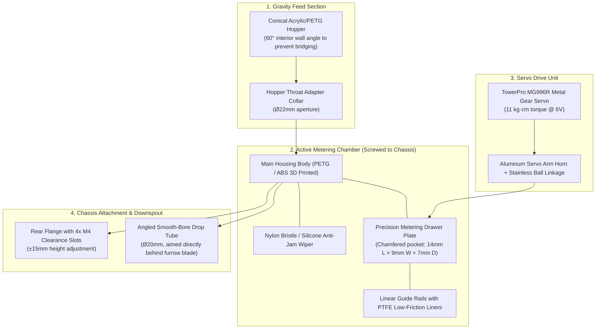

# Autonomous Maize Rover: Servo-Actuated Seeding Mechanism Design

**Component Name**: Reciprocating Shuttle Maize Seed Metering & Dispensing Pod  
**Actuator**: TowerPro MG996R / DS3218 Metal Gear Standard Servo (Pin D10)  
**Mounting Interface**: 4× M4 Socket Head Cap Screws to Chassis Mounting Flange  
**Seed Target**: Zea mays (Maize / Corn: ~9–12 mm kernel length, ~6–8 mm width)

---

## 1. Engineering 3D CAD Visualization


---

## 2. Working Principle: Reciprocating Shuttle Slider with Flexible Wiper

Maize seeds have an irregular, flat, teardrop geometry that easily bridges and wedges in conventional rotary star-wheels or tight augers.  
The **Reciprocating Shuttle Slider with a Flexible Bristle Wiper** solves this with a 3-step cycle:

```mermaid
sequenceDiagram
    autonumber
    participant H as Conical Hopper
    participant W as Flexible Bristle Wiper
    participant S as Metering Slider Drawer
    participant C as Drop Tube Chute

    Note over S: Position 0° (Closed / Fill)
    H->>S: 1-2 Maize Kernels drop into calibrated pocket by gravity
    Note over S: Servo rotates 60° (Forward Stroke)
    S->>W: Slider moves forward; Wiper sweeps away excess kernels without crushing
    Note over S: Position 60° (Discharge)
    S->>C: Pocket aligns over discharge chute; seed drops by gravity into furrow
    Note over S: Servo rotates back to 0° (Return Stroke)
    S->>H: Slider returns under hopper to reload for next furrow drop
```

---

## 3. Subsystem Component Breakdown



---

## 4. Mechanical Mounting to the Rover Body

### 4.1 Bolt Pattern & Physical Placement
- **Location**: Bolted to the **rear or central longitudinal centerline** of the rover chassis, directly trailing the mechanical furrow opener (chisel/shoe) and preceding the furrow closing wheel / irrigation nozzle.
- **Fasteners**: **4× M4 × 16 mm Stainless Steel Hex Socket Cap Screws** with lock washers and nylon-insert lock nuts (or threaded brass heat-set inserts on the chassis).
- **Height Adjustability**: The rear mounting flange features **slotted vertical mounting holes** ($4.5\text{ mm} \times 12\text{ mm}$), enabling $\pm10\text{ mm}$ of ground clearance adjustment depending on field terrain roughness and furrow depth.
- **Vibration Dampening**: 2mm neoprene or silicone rubber gaskets are sandwiched between the mechanism's mounting plate and the rover's aluminum chassis to isolate servo gearboxes from rough soil vibrations.

### 4.2 Chassis Wiring & Cable Routing
- The servo wire (Brown/GND, Red/+5V, Orange/Signal) passes through an **integrated rear conduit with a rubber grommet** directly into the rover's sealed electronics compartment.
- Connects directly to **Arduino Uno R4 Pin D10** and a dedicated **external 5V–6V 3A buck converter** (avoid powering servos directly from the Arduino's 5V onboard regulator to prevent MCU brownout resets).

---

## 5. Anti-Jamming & Seed Damage Prevention Features

1. **Flexible Bristle Wiper**:
   - Rigid pinch-points are the #1 cause of jammed seed dispensers.
   - A stiff nylon bristle strip (or 1.5mm flexible silicone flap) sits right above the sliding pocket. When more than one seed enters the chamber, the brush gently deflects extra seeds backwards into the hopper without cracking the seed coat or stalling the servo.
2. **Chamfered Pocket Edges**:
   - The pocket on the slider plate has $45^\circ$ internal lead-in fillets to allow kernels to settle naturally without standing on end.
3. **High-Torque Metal Geared Servo**:
   - The **MG996R** provides **$11\text{ kg}\cdot\text{cm}$ of stall torque**, ensuring that even if dust or chaff enters the slide rails, the mechanism will not bind or lock up.

---

## 6. Firmware Control Integration

The mechanism maps directly to the rover's active firmware:

```cpp
// In MaizeRover_Phase2_Master.ino
#define SEED_SERVO_PIN 10
Servo seedServo;

void setup() {
  seedServo.attach(SEED_SERVO_PIN);
  seedServo.write(0); // 0°: Hopper Pocket Under Fill Throat
}

void actuateSeedDrop() {
  // 1. Move slider forward to drop position
  seedServo.write(60);  // 60°: Pocket Aligned Over Discharge Chute
  delay(180);           // Allow seed to free-fall by gravity
  
  // 2. Return slider to reload pocket for next furrow drop
  seedServo.write(0);   // 0°: Return to fill position
  delay(100);
}
```

---

## 7. Bill of Materials (BOM)

| Item | Component Description | Material / Source | Qty |
| :---: | :--- | :--- | :---: |
| **1** | Main Dispenser Housing Body | 3D Printed PETG / ABS (0.2mm layer, 40% gyroid infill) | 1 |
| **2** | Reciprocating Metering Slider Plate | 3D Printed PETG or CNC Delrin / Acetal (low friction) | 1 |
| **3** | Seed Hopper (500 ml capacity) | Clear Acrylic / Molded PETG Cone (60° taper) | 1 |
| **4** | Servo Motor (Metal Gear) | TowerPro MG996R or DS3218 High-Torque Servo | 1 |
| **5** | Anti-Jam Wiper | Nylon Bristle Strip / 1.5mm Silicone Flap | 1 |
| **6** | Linkage Push-Rod | M3 Stainless Steel Ball-Joint Linkage (25mm) | 1 |
| **7** | Chassis Mounting Screws | M4 × 16 mm Socket Head Cap Screws + Lock Nuts | 4 |
| **8** | Housing Assembly Fasteners | M3 × 12 mm Button Head Screws + Heat-set Brass Inserts | 6 |
| **9** | Downspout Chute Tube | Ø20mm Clear Acrylic / Polycarbonate Tube (cut to height) | 1 |
